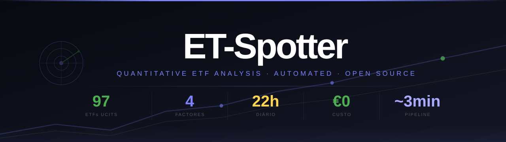
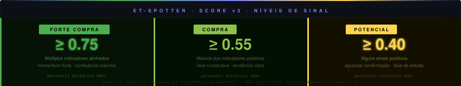
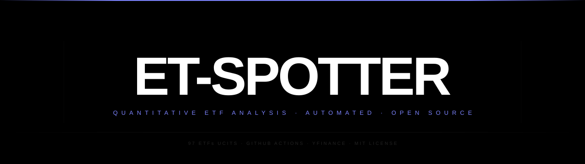
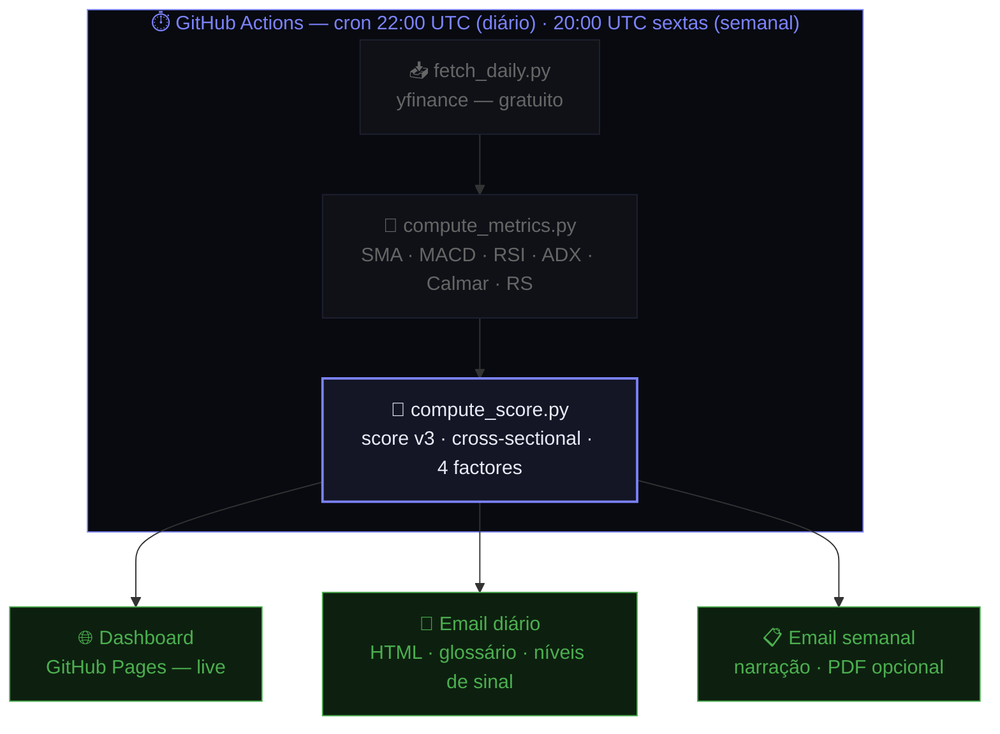
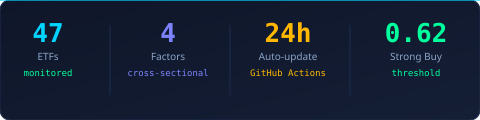
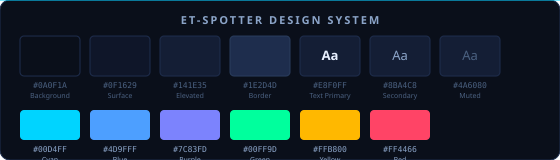

<div align="center">


<br>

[](https://nunovinhas-creator.github.io/ET-spotter)
&nbsp;
[](https://github.com/nunovinhas-creator/ET-spotter/actions/workflows/daily.yml)
[](https://github.com/nunovinhas-creator/ET-spotter/actions/workflows/weekly.yml)
&nbsp;
[](https://python.org)
[](LICENSE)
[](https://hits.sh/github.com/nunovinhas-creator/ET-spotter/)
[](https://github.com/nunovinhas-creator/ET-spotter/commits)
[](https://github.com/nunovinhas-creator/ET-spotter/graphs/commit-activity)
[](https://github.com/nunovinhas-creator/ET-spotter)
[](https://github.com/nunovinhas-creator/ET-spotter/issues)

<br>


</div>

<br>

<details>
<summary><b>📑 Índice rápido</b></summary>
<br>

- [📬 O que recebes](#-o-que-recebes)
- [⚡ Quick Start — 4 passos](#-quick-start--4-passos-3-minutos)
- [🔬 Como funciona](#-como-funciona)
- [🧮 Score v3 — Metodologia](#-score-v3--metodologia)
- [🗂️ Universo ETF](#️-universo--97-etfs-ucits-em-11-categorias)
- [🏛️ Base Académica](#️-base-académica)
- [🗺️ Roadmap](#️-roadmap)
- [⭐ Contribuir e Partilhar](#-contribuir-e-partilhar)

</details>

<br>

---

## 📬 O que recebes

<table>
<tr>
<td width="33%" align="center">

### 📧 Email Diário

Todos os dias às 22h, após o fecho dos mercados, um relatório com os ETFs melhor posicionados, sinais de compra por nível de convicção, rotação sectorial e análise em linguagem simples — com glossário para quem começa.

</td>
<td width="33%" align="center">

### 📊 Dashboard Live

Scores em tempo real para todos os 97 ETFs: sub-barras de momentum · tendência · risco · alpha, filtros por categoria e histórico de scores.

**[→ Abrir Dashboard](https://nunovinhas-creator.github.io/ET-spotter)**

</td>
<td width="33%" align="center">

### 📋 Relatório Semanal

Às sextas-feiras, análise consolidada com os 3 ETFs mais bem posicionados, narrativa de qualidade do sinal e evolução da semana — com PDF opcional.

</td>
</tr>
</table>



> **Zero custo de infra-estrutura.** Corre inteiramente no plano gratuito do GitHub Actions —
> sem servidores, sem subscriptions, sem APIs pagas. O único requisito é uma conta Gmail.

<br>

---

## ⚡ Quick Start — 4 passos, ~3 minutos

**`1`** — Fork este repositório (botão **Fork** no canto superior direito)

**`2`** — Adiciona 3 Secrets: **Settings → Secrets and variables → Actions → New repository secret**

| Secret | Descrição |
|--------|-----------|
| `EMAIL_FROM` | Gmail de envio (ex: `meubot@gmail.com`) |
| `EMAIL_PASSWORD` | [App Password Gmail](https://myaccount.google.com/apppasswords) — não a tua password normal |
| `EMAIL_TO` | Email de destino, ou lista separada por vírgulas |

**`3`** — Activa permissões de escrita: **Settings → Actions → General → Workflow permissions → Read and write permissions**

**`4`** — Lança o primeiro relatório: **Actions → Daily Report → Run workflow**

Em ~3 minutos recebes o email e o dashboard publica-se em `https://<o-teu-username>.github.io/ET-spotter`

<details>
<summary><b>🎨 Variante de banner (minimalista)</b></summary>

<br>



Para usar este banner, substitui na primeira linha do README:
```
docs/assets/banner.svg  →  docs/assets/banner-minimal.svg
```

</details>

<details>
<summary><b>📊 Activar analytics GoatCounter (privacy-first)</b></summary>

<br>

1. Cria conta gratuita em [goatcounter.com](https://www.goatcounter.com/) — sem cookies, GDPR-compliant
2. O teu código de conta é a parte antes de `.goatcounter.com` no URL do painel (ex: `meu-projeto`)
3. Edita `config/etfs.json` → secção `"params"`:

```json
"goatcounter_code": "meu-projeto"
```

4. O dashboard inclui automaticamente o script de tracking na próxima geração.

</details>

<details>
<summary><b>🔔 Activar alertas Push (Web Push API)</b></summary>

<br>

O dashboard já tem a infra implementada (service worker + subscribe button). Para activar:

1. Gera um par de chaves VAPID:
```bash
npx web-push generate-vapid-keys
```

2. Adiciona a chave pública em `config/etfs.json` → secção `"params"`:
```json
"vapid_public_key": "BEL_a_tua_chave_publica_aqui"
```

3. O botão "🔔 Activar alertas" aparece automaticamente no dashboard após regeneração.

> A chave privada deve ser configurada como secret `VAPID_PRIVATE_KEY` no GitHub Actions para envio de notificações.

</details>

<details>
<summary><b>⚙️ Configuração local (desenvolvimento)</b></summary>

<br>

```bash
git clone https://github.com/nunovinhas-creator/ET-spotter
cd ET-spotter
pip install -r requirements.txt

# Pipeline completo
python scripts/fetch_daily.py          # dados EOD via yfinance (gratuito)
python scripts/compute_metrics.py      # SMA, MACD, RSI, ADX, drawdown, Calmar
python scripts/compute_score.py        # score v3 cross-sectional
python scripts/generate_dashboard.py   # gera docs/index.html

# Relatórios (requer variáveis EMAIL_* no ambiente)
python scripts/daily_report.py
python scripts/weekly_report.py
```

Para desenvolvimento sem enviar emails, omite o último passo — o HTML gerado fica em `data/reports/`.

</details>

<br>

---

## 🔬 Como funciona



O pipeline completo corre em **~3 minutos** sem intervenção humana, 365 dias por ano.  
O branch `gh-pages` é actualizado por git plumbing — sem workflows adicionais, sem dependências.

<br>

---

## 🧮 Score v3 — Metodologia

Cada ETF é avaliado **cross-sectionalmente**: comparado com o universo completo no mesmo instante, não em valor absoluto. Todos os factores passam por **winsorização (±2.5σ)** e **z-score normalizado** antes de serem combinados.

| Factor | Peso | Componentes | Referência académica |
|--------|:----:|-------------|----------------------|
| **Momentum** | **35%** | Retorno normalizado 21d · 63d · 126d via sigmoid cross-sectional | [](https://doi.org/10.1111/j.1540-6261.1993.tb04702.x) |
| **Tendência** | **25%** | SMA cruzada · MACD bullish · RSI zone (40–65) · RS contínuo vs SPY | [](https://papers.ssrn.com/sol3/papers.cfm?abstract_id=962461) |
| **Risco** | **25%** | Calmar ratio 63d · ADX > 20 · drawdown actual | [](https://doi.org/10.1111/j.1540-6261.2006.01054.x) |
| **Alpha quality** | **15%** | IR-momentum · aceleração · RS contínuo · 12M annual | [](https://arxiv.org/abs/1601.00991) |

**Níveis de sinal:**&nbsp;


O `score_pct` mede o **percentil histórico** do score nos últimos 252 dias desse ETF — um score de `0.85` significa que está nos 15% melhores da sua própria história recente.

<br>

---

## 🗂️ Universo — 97 ETFs UCITS em 11 categorias

| Categoria | ETFs | Exemplos |
|-----------|:----:|----------|
| 🇺🇸 EUA – Mercado Largo | 8 | CSPX.L · VUAA.L · VUSA.L |
| 🌍 Global / MSCI World | 10 | IWDA.L · HMWO.L · SWRD.L |
| 🏭 EUA – Sectores UCITS | 11 | IUHC.L · IUFS.L · IUIT.L |
| 🌐 Internacional Desenvolvido | 10 | VEUR.L · VERX.L · HMCA.L |
| 🌏 Mercados Emergentes | 8 | EMIM.L · VFEM.L · IEEM.L |
| 📐 Factor / Smart Beta | 8 | IWMO.L · IWVL.L · IWQU.L |
| 💡 Temáticos / Inovação | 11 | EQQQ.L · RBOT.L · HEAL.L |
| 🥇 Commodities | 8 | IGLN.L · PHAU.L · PHAG.L |
| 🏦 Obrigações / Fixed Income | 12 | AGGU.L · IBTS.L · IBTL.L |
| 🏠 Imobiliário / REITs | 5 | IWDP.L · IPRP.L |
| 🌱 ESG / Sustentável | 6 | SUSW.L · MVEW.L |

<details>
<summary><b>📋 Ver todos os tickers por categoria</b></summary>

<br>

**EUA – Mercado Largo (8)**  
`CSPX.L` `VUAA.L` `VUSA.L` `IUSA.L` `XDEQ.L` `SPXS.L` `XDWD.DE` `VWCE.DE`

**Global / MSCI World (10)**  
`IWDA.L` `HMWO.L` `SWRD.L` `XMAW.L` `VWRL.L` `VWRP.L` `IWFM.L` `MVOL.L` `WSML.L` `XDWT.DE`

**EUA – Sectores UCITS (11)**  
`IUHC.L` `IUFS.L` `IUIT.L` `IUCS.L` `IUCD.L` `IUES.L` `IUCM.L` `IUMS.L` `IUIS.L` `IUUS.L` `FWRA.L`

**Internacional Desenvolvido (10)**  
`VEUR.L` `VERX.L` `HMCA.L` `SMEA.L` `HMJP.L` `IJPA.L` `IIND.L` `XAUS.L` `CUKX.L` `VUKE.L`

**Mercados Emergentes (8)**  
`EMIM.L` `VFEM.L` `IEEM.L` `EIMI.L` `XMEM.DE` `HMEF.L` `SEMB.L` `XNAS.L`

**Factor / Smart Beta (8)**  
`IWMO.L` `IWVL.L` `IWQU.L` `IWSZ.L` `IQSA.L` `IBZL.L` `IDTP.L` `GLRE.L`

**Temáticos / Inovação (11)**  
`EQQQ.L` `RBOT.L` `HEAL.L` `INRG.L` `CYBR.L` `BTEC.L` `DGTL.L` `WTAI.L` `CNDX.L` `XAIX.L` `ECAR.L`

**Commodities (8)**  
`IGLN.L` `PHAU.L` `PHAG.L` `PHPT.L` `SGLN.L` `AIGA.L` `CRUD.L` `SXLP.L`

**Obrigações / Fixed Income (12)**  
`AGGU.L` `IBTS.L` `IBTL.L` `IBTM.L` `IEAG.L` `IGLO.L` `IGLT.L` `IHYG.L` `LQDE.L` `SLXX.L` `IEMB.L` `VGOV.L`

**Imobiliário / REITs (5)**  
`IWDP.L` `IPRP.L` `IAPD.L` `XREA.L` `GLRE.L`

**ESG / Sustentável (6)**  
`SUSW.L` `MVEW.L` `SUWS.L` `MSEW.L` `MVOL.L` `IUUS.L`

</details>

Qualquer ticker disponível no **Yahoo Finance** pode ser adicionado em `config/etfs.json`.

<br>

---

## 🏛️ Base Académica

Os factores do score v3 têm suporte em literatura peer-reviewed publicada em journals de referência em finanças quantitativas:

[-7c83fd?style=flat-square&logo=academia)](https://doi.org/10.1111/j.1540-6261.1993.tb04702.x)
[-7c83fd?style=flat-square&logo=academia)](https://papers.ssrn.com/sol3/papers.cfm?abstract_id=962461)
[-7c83fd?style=flat-square&logo=academia)](https://doi.org/10.1111/j.1540-6261.2006.01054.x)
[-7c83fd?style=flat-square&logo=arxiv)](https://arxiv.org/abs/1601.00991)

> Os sinais identificam convergência estatística de factores — **não constituem aconselhamento financeiro** e não predizem preços futuros. Consulta sempre um profissional antes de investir.

<br>

---

## 🗺️ Roadmap

| Estado | Feature |
|:------:|---------|
| ✅ | Score v3 cross-sectional — 4 factores com pesos académicos |
| ✅ | Dashboard GitHub Pages — PWA, offline, sparklines |
| ✅ | Email diário + semanal com glossário e narrativa em PT-PT |
| ✅ | Backtest automático de sinais (forward return 21d) |
| ✅ | Portfólio tracker opcional (integração Alpaca) |
| ✅ | GoatCounter analytics (privacy-first, sem cookies) |
| 🔄 | Alertas push Web Push API (VAPID — infra pronta) |
| 📋 | Subscrição sem fork — email externo serverless |
| 📋 | Score v4 — factor ML com SHAP explainability |
| 📋 | Backtesting visual interactivo no dashboard |
| 📋 | Exportação CSV/PDF de relatórios históricos |

<br>

---

## ⭐ Contribuir e Partilhar

Se o ET-Spotter te foi útil, uma estrela ajuda outros investidores a encontrá-lo.

[](https://github.com/nunovinhas-creator/ET-spotter/stargazers)
[](https://github.com/nunovinhas-creator/ET-spotter/fork)
[](https://github.com/nunovinhas-creator/ET-spotter/issues)

<div align="center">

<a href="https://github.com/nunovinhas-creator/ET-spotter">
  
</a>

</div>

<br>

Pull requests são bem-vindos. Para mudanças de fundo, abre primeiro uma issue.

```bash
git checkout -b feature/nova-funcionalidade
git commit -m "feat: descrição clara do que foi adicionado"
git push origin feature/nova-funcionalidade
# Abre Pull Request no GitHub
```

<br>

---

<details>
<summary><b>❓ FAQ</b></summary>

<br>

**É realmente gratuito?**  
Sim. yfinance usa dados públicos do Yahoo Finance (sem API key). O pipeline usa ~3 min/dia dos 2 000 min/mês do GitHub Actions free tier. Gmail SMTP é gratuito. Custo total: **€0**.

**Os sinais são recomendações de investimento?**  
Não. Os sinais identificam convergência estatística de factores técnicos históricos — não predizem preços futuros. Usa como input sistemático, não como recomendação isolada.

**Posso adicionar ETFs fora do universo?**  
Sim. Qualquer ticker no Yahoo Finance funciona — adiciona em `config/etfs.json` seguindo a estrutura existente.

**Posso usar outros servidores de email além do Gmail?**  
Sim. Configura `EMAIL_HOST` e `EMAIL_PORT` em `config/etfs.json`. Qualquer servidor SMTP funciona.

**O que é o `score_pct`?**  
O percentil histórico: `0.85` significa que o score actual está nos 15% melhores dos últimos 252 dias históricos desse ETF — contexto sobre se o sinal é forte ou fraco para esse activo específico.

**Com que frequência são actualizados os dados?**  
Dados EOD: uma vez por dia após 22h UTC. Dados intraday: de hora em hora durante o horário de mercado europeu/americano.

**Posso receber os relatórios sem fazer fork?**  
Actualmente, a subscrição externa está em roadmap. Por agora, o fork é o caminho recomendado.

</details>

<details>
<summary><b>🎨 Assets visuais — Design System</b></summary>

<br>



<br>


<br>

**Badges:**

 &nbsp;
 &nbsp;
 &nbsp;


<br><br>

**Icons:**

 &nbsp;
 &nbsp;
 &nbsp;
 &nbsp;
 &nbsp;


<br><br>

**Palette:**



</details>

<details>
<summary><b>📁 Estrutura do repositório</b></summary>

<br>

```
ET-spotter/
├── config/
│   └── etfs.json                  # 97 ETFs, 11 categorias, parâmetros e pesos
├── data/
│   ├── daily/                     # métricas diárias por ETF (CSV, um por ticker)
│   └── reports/                   # scores_latest.csv · scores_history.csv
├── docs/                          # GitHub Pages
│   ├── assets/
│   │   ├── banners/               # banner-1920x480.svg · banner-1200x300.svg
│   │   ├── icons/                 # 6 ícones SVG (dashboard, scoring, alerts, etfs, data, reports)
│   │   ├── badges/                # 4 badges SVG personalizados
│   │   ├── dividers/              # 3 dividers SVG (simple, double, glow)
│   │   ├── components/            # card-signal · stats-block · highlight-box · color-palette
│   │   └── banner.svg             # banner principal do README
│   ├── index.html                 # dashboard (gerado automaticamente)
│   ├── manifest.json              # PWA manifest
│   └── sw.js                      # Service Worker (cache offline)
├── scripts/
│   ├── fetch_daily.py             # dados EOD via yfinance
│   ├── fetch_intraday.py          # dados intraday horários
│   ├── compute_metrics.py         # SMA · MACD · RSI · ADX · drawdown · Calmar · RS
│   ├── compute_score.py           # score v3 — 4 factores cross-sectionais
│   ├── generate_dashboard.py      # dashboard HTML completo com gráficos
│   ├── daily_report.py            # email diário com intro + glossário
│   ├── weekly_report.py           # relatório semanal + PDF opcional
│   ├── email_helpers.py           # blocos HTML reutilizáveis (intro, glossário)
│   ├── generate_charts.py         # gráficos matplotlib (barras, tendência, heatmap)
│   ├── portfolio_tracker.py       # integração Alpaca (opcional)
│   ├── backtest_signals.py        # backtest de sinais históricos
│   └── send_email.py              # envio SMTP genérico
└── .github/workflows/
    ├── daily.yml                  # cron 22:00 UTC — pipeline completo
    ├── hourly.yml                 # cron horário — dados intraday + dashboard
    └── weekly.yml                 # sextas 20:00 UTC — relatório semanal
```

</details>

<br>

---

<div align="center">


<sub>ET-Spotter · MIT License · Dados via yfinance · Automação via GitHub Actions</sub><br>
<sub>Análise técnica baseada em evidência histórica — não constitui aconselhamento financeiro.</sub>

</div>
