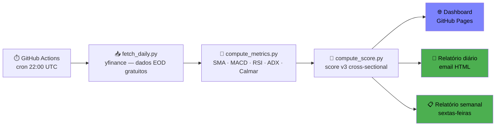

<div align="center">

# ET-Spotter 📡

**Análise quantitativa automática de 97 ETFs UCITS — gratuito, open-source, com base académica.**

Todos os dias às 22h um relatório chega ao teu email com os ETFs melhor posicionados,  
baseado em 4 factores (momentum · tendência · risco · alpha) — sem custo de infra-estrutura.

[](https://nunovinhas-creator.github.io/ET-spotter)
[](https://github.com/nunovinhas-creator/ET-spotter/actions/workflows/daily.yml)
[](https://www.python.org/)
[](LICENSE)
[](https://hits.sh/github.com/nunovinhas-creator/ET-spotter/)

</div>

---

## O que recebes

| | |
|:---:|:---|
| **📧 Email diário** | Top ETFs por score técnico composto, com sinais de compra, rotação sectorial e análise em linguagem simples. Chega depois do fecho dos mercados. |
| **📊 Dashboard interativo** | Scores em tempo real para todos os 97 ETFs: barras de momentum · tendência · risco · alpha, gráficos históricos, filtros por categoria. |
| **📋 Relatório semanal** | Análise consolidada às sextas com os 3 ETFs mais bem posicionados e contexto de evolução semanal. |

> **Zero custo de infra-estrutura.** Corre inteiramente no plano gratuito do GitHub Actions —  
> sem servidores, sem subscriptions, sem APIs pagas.

---

## Dashboard

🔴 **Live →** [nunovinhas-creator.github.io/ET-spotter](https://nunovinhas-creator.github.io/ET-spotter)

Actualizado automaticamente todos os dias após o fecho do mercado americano (22h UTC).

---

## Como funciona



O pipeline completo corre em ~3 minutos, sem intervenção humana, 365 dias por ano.

---

## Metodologia de Scoring (v3)

Cada ETF é avaliado **cross-sectionalmente** — em relação a todo o universo no mesmo instante, não em valor absoluto. Todos os factores passam por winsorização (±2.5σ) e z-score normalizado antes de serem combinados.

| Factor | Peso | Componentes | Base académica |
|--------|------|-------------|----------------|
| **Momentum** | 35% | Retorno normalizado a 21d, 63d e 126d via sigmoid cross-sectional | Jegadeesh & Titman (1993) |
| **Tendência** | 25% | SMA cruzada · MACD bullish · RSI zone · força relativa contínua vs SPY | Faber (2007) |
| **Risco** | 25% | Calmar ratio 63d · ADX · drawdown actual | Ang, Hodrick et al. (2006) |
| **Alpha quality** | 15% | IR-momentum · aceleração de momentum · RS contínuo · momentum anual 12M | Kakushadze (2015) — alpha101 |

**Limiares de sinal:** `FORTE COMPRA` ≥ 0.75 · `COMPRA` ≥ 0.55 · `POTENCIAL` ≥ 0.40

O `score_pct` mede o percentil do score actual em relação aos últimos 252 dias históricos do mesmo ETF — permite contextualizar se o score é alto ou baixo para esse ETF em específico.

---

## Universo — 97 ETFs UCITS em 11 categorias

| Categoria | ETFs | Exemplos |
|-----------|:----:|---------|
| EUA – Mercado Largo | 8 | CSPX.L · VUAA.L · VUSA.L |
| Global / MSCI World | 10 | IWDA.L · HMWO.L · SWRD.L |
| EUA – Sectores UCITS | 11 | IUHC.L · IUFS.L · IUIT.L |
| Internacional Desenvolvido | 10 | VEUR.L · VERX.L · EWJ.L |
| Mercados Emergentes | 8 | EMIM.L · VFEM.L · HMEF.L |
| Factor / Smart Beta | 8 | IWMO.L · IWVL.L · IQSA.L |
| Temáticos / Inovação | 11 | EQQQ.L · IITU.L · HEAL.L |
| Commodities | 8 | IGLN.L · SXLP.L · AIGA.L |
| Obrigações / Fixed Income | 12 | AGGU.L · IBTS.L · IEMB.L |
| Imobiliário / REITs | 5 | IWDP.L · XREA.L |
| ESG / Sustentável | 6 | SUWS.L · MSEW.L |

Qualquer ETF com ticker disponível no Yahoo Finance pode ser adicionado em `config/etfs.json`.

---

## Quick Start

### 1. Fork o repositório

Clica em **Fork** no canto superior direito desta página.

### 2. Configura os Secrets

No teu fork: **Settings → Secrets and variables → Actions → New repository secret**

| Secret | Descrição |
|--------|-----------|
| `EMAIL_FROM` | Gmail de envio (ex: `meubot@gmail.com`) |
| `EMAIL_PASSWORD` | [App Password](https://myaccount.google.com/apppasswords) do Gmail — não a password normal |
| `EMAIL_TO` | Email(s) de destino, separados por vírgula |

### 3. Activa permissões de escrita

**Settings → Actions → General → Workflow permissions** → selecciona **Read and write permissions**

### 4. Testa

No separador **Actions**, selecciona `Daily Report` → **Run workflow**. Em ~3 minutos recebes o primeiro email e o dashboard é publicado em `https://<o-teu-user>.github.io/ET-spotter`.

### Uso local

```bash
git clone https://github.com/nunovinhas-creator/ET-spotter
cd ET-spotter
pip install -r requirements.txt

python scripts/fetch_daily.py         # dados EOD via yfinance
python scripts/compute_metrics.py     # SMA, MACD, RSI, ADX, drawdown, Calmar
python scripts/compute_score.py       # score v3 cross-sectional
python scripts/generate_dashboard.py  # gera docs/index.html
python scripts/daily_report.py        # gera e envia email (requer EMAIL_* vars)
```

---

## Estrutura do Repositório

```
ET-spotter/
├── config/
│   └── etfs.json              # 97 ETFs, categorias, cores, parâmetros
├── data/
│   ├── daily/                 # métricas diárias por ETF (CSV)
│   └── reports/               # scores_latest.csv, scores_history.csv
├── docs/                      # GitHub Pages — dashboard HTML
├── scripts/
│   ├── fetch_daily.py         # recolha EOD via yfinance (gratuito)
│   ├── fetch_intraday.py      # dados intraday horários
│   ├── compute_metrics.py     # SMA, MACD, RSI, ADX, drawdown, Calmar, RS
│   ├── compute_score.py       # score v3 — 4 factores cross-sectionais
│   ├── generate_dashboard.py  # dashboard HTML com gráficos interactivos
│   ├── daily_report.py        # email diário com intro + glossário acessível
│   ├── weekly_report.py       # relatório semanal + PDF opcional
│   ├── email_helpers.py       # blocos HTML reutilizáveis para emails
│   └── send_email.py          # envio SMTP genérico
└── .github/workflows/
    ├── daily.yml              # cron 22:00 UTC — pipeline completo diário
    ├── hourly.yml             # cron horário — dados intraday
    └── weekly.yml             # sextas 20:00 UTC — relatório semanal
```

---

## FAQ

**É realmente gratuito?**  
Sim. yfinance usa dados públicos do Yahoo Finance. O pipeline usa ~3 min/dia dos 2 000 min/mês gratuitos do GitHub Actions. Gmail SMTP é gratuito. Custo total: €0.

**Os sinais são recomendações de investimento?**  
Não. Os sinais identificam convergência estatística de factores técnicos históricos — não prevêem preços futuros. Usa como input sistemático, não como recomendação isolada. Consulta sempre um profissional antes de investir.

**Funciona para ETFs fora do universo incluído?**  
Sim. Qualquer ticker disponível no Yahoo Finance pode ser adicionado em `config/etfs.json` seguindo a estrutura existente.

**Posso adaptar para acções ou outros instrumentos?**  
O scoring é agnóstico ao instrumento — qualquer activo com histórico de preços no Yahoo Finance funciona. A nomenclatura UCITS é apenas organizacional.

**O que é o `score_pct`?**  
O percentil histórico: `score_pct = 0.85` significa que o score actual está no top 15% dos scores históricos desse ETF nos últimos 252 dias — contexto sobre se o sinal é forte ou fraco para esse ETF em específico.

---

## Contribuir

Issues e pull requests são bem-vindos. Para mudanças de fundo, abre primeiro uma issue para alinhar a direcção.

```bash
git checkout -b feature/nova-funcionalidade
# faz as alterações
git commit -m "feat: descrição clara do que foi adicionado"
git push origin feature/nova-funcionalidade
# abre Pull Request
```

---

## Licença

MIT © [Nuno Vinhas](https://github.com/nunovinhas-creator)

---

<div align="center">
<sub>ET-Spotter não constitui aconselhamento financeiro.<br>Análise técnica baseada em evidência histórica — os sinais identificam convergência estatística de factores, não predizem preços futuros.</sub>
</div>
